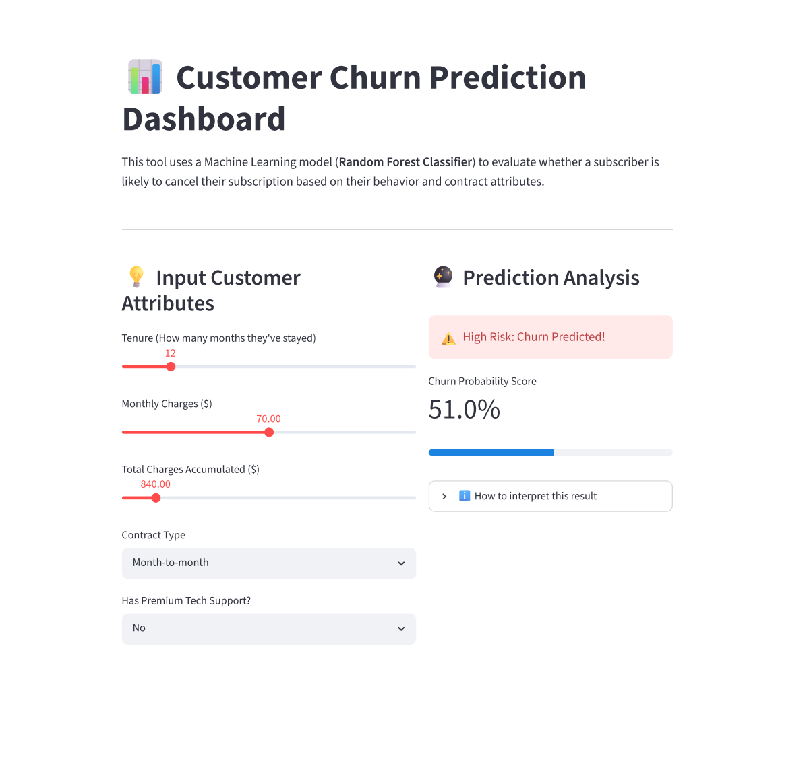

# 📊 Customer Churn Prediction Dashboard

A Machine Learning web application that predicts the likelihood of a subscriber canceling their service based on their tenure, contract details, and charges. 

This project demonstrates a complete end-to-end data pipeline: from generating a custom synthetic dataset to training a machine learning classifier, and finally deploying it as an interactive web dashboard.



---

## 🚀 Live Demo Profile
* Tech Stack: Python, Scikit-Learn, Streamlit, Pandas, NumPy
* Core Model: Random Forest Classifier

---

## 💡 How It Works (The ML Pipeline)

1. Synthetic Data Creation: The app generates a dataset of 1,000 customers with behaviors mirroring real-world subscription patterns (e.g., month-to-month users with high monthly costs are statistically penalized to simulate realistic high risk).
2. Feature Engineering: Categorical variables like "Contract Type" and "Tech Support" are encoded numerically using Scikit-Learn's `LabelEncoder`.
3. Model Training: Data is split into training and testing sets (80/20 split). A **Random Forest Classifier** trains on the historical attributes to map combinations of inputs to a definitive churn risk percentage.
4. Interactive UI: The user moves sliders or changes dropdown values in the web interface, passing fresh inputs into the trained model to spit out a real-time risk evaluation.

---

## 🛠️ How to Run This Project Locally

1. Prerequisites
Make sure you have Python installed on your computer.

2. Clone the Repository

```bash
git clone [https://github.com/](https://github.com/)[navyaajain-hub]/[Customer-churn-predictor].git
cd [Customer-churn-predictor]

3. Install dependencies

```bash
pip install pandas scikit-learn streamlit

4. Launch the app

```bash
python -m streamlit run app.py


📊 Feature Overview & User Guide

1. Tenure Slider: Adjust how many months the customer has been with the company.

2. Contract Selection: Toggle between flexible Month-to-month agreements and stable Two-year commitments to observe how heavily locking in a plan reduces churn risk.

3. Risk Meter: A visual percentage output coupled with dynamic logic cards telling the user whether to place an account on a standard watchlist or deploy immediate promotional incentives to keep them.


🧑‍💻 Author

Developed by [Navya Jain]

GitHub: @[navyaajain-hub]

LinkedIn: [https://www.linkedin.com/in/navya-jain-9b23b0376?utm_source=share_via&utm_content=profile&utm_medium=member_android]


